# Hệ thống Quản lý Danh mục Điện tử - Nông nghiệp & Môi trường

## Tổng quan

Đây là ứng dụng Flutter được thiết kế để quản lý danh mục điện tử dùng chung cho ngành Nông nghiệp và Môi trường. Hệ thống hỗ trợ quản lý sản phẩm, danh mục, dữ liệu môi trường, vị trí, và báo cáo thống kê, giúp người dùng dễ dàng theo dõi và đồng bộ dữ liệu giữa offline và online.

## Tính năng chính

### Trang chủ
- Tổng quan thống kê sản phẩm
- Hiển thị danh mục sản phẩm
- Sản phẩm gần đây

### Quản lý Sản phẩm
- Thêm, sửa, xóa sản phẩm
- Tìm kiếm và lọc sản phẩm theo danh mục
- Quản lý thông tin chi tiết sản phẩm
- Theo dõi tồn kho và giá cả

### Quản lý Danh mục
- Phân loại sản phẩm theo loại
- Hỗ trợ danh mục con
- Quản lý icon và màu sắc cho từng danh mục

### Báo cáo & Thống kê
- Biểu đồ xu hướng sản phẩm
- Phân bố theo danh mục
- Thống kê dữ liệu môi trường
- Báo cáo tổng quan

### Cài đặt
- Thay đổi giao diện
- Tự động đồng bộ dữ liệu
- Thông tin ứng dụng

## Phân quyền người dùng
| Vai trò    | Quyền hạn          | Mô tả                                                                                                    |
| ---------- | ------------------ | ---------------------------------------------------------------------------------------------------------|
| **Admin**  | Toàn quyền         | - Quản lý tất cả dữ liệu (sản phẩm, danh mục, môi trường, vị trí)<br>- Cấp quyền cho người dùng khác<br> |
| **Editor** | Chỉnh sửa nội dung | - Thêm, sửa, xóa dữ liệu trong phạm vi được phân công<br>- Không có quyền quản lý người dùng             |
| **Viewer** | Xem dữ liệu        | - Chỉ được phép xem thông tin và báo cáo<br>- Không thể chỉnh sửa hoặc xóa dữ liệu                       |

| Quyền              |  Admin |        Editor       | Viewer |
| ------------------ | ------ | ------------------- | ------ |
| Thêm dữ liệu       |    X   |          X          |        |
| Sửa dữ liệu        |    X   |          X          |        |
| Xóa dữ liệu        |    X   |                     |        |
| Xem dữ liệu        |    X   |          X          |    X   |
| Quản lý phân quyền |    X   |                     |        |

## Cấu trúc dự án

```
lib/
│
├── config/                # Cấu hình
│
├── local/                 # Dữ liệu và thao tác lưu trữ cục bộ
│  
├── models/                # Định nghĩa các model dữ liệu
│
├── providers/             # State management (Provider / ChangeNotifier)
│
├── repositories/          # Xử lý trung gian giữa local DB và remote API
│
├── services/              # Tầng giao tiếp với server (Supabase / API)
│
├── screens/               # Giao diện người dùng (UI)
│
├── widgets/               # Các widget tái sử dụng (custom components)
│
└── main.dart              #  Entry point của ứng dụng
```

```scss
UI → Provider → Repository → Service (Supabase RPC)
```

## Các thư viện sử dụng

| Package                | Version | Mục đích                                      |
| ---------------------- | ------- | --------------------------------------------- |
| **flutter**            | sdk     | Framework chính                               |
| **provider**           | ^6.1.2  | State management                              |
| **shared_preferences** | ^2.3.2  | Lưu trữ dữ liệu đơn giản (theme, cài đặt,...) |
| **http**               | ^1.2.2  | Giao tiếp API                                 |
| **image_picker**       | ^1.1.2  | Chọn hình ảnh từ camera/gallery               |
| **intl**               | ^0.20.2 | Xử lý định dạng ngày giờ, số,...              |
| **fl_chart**           | ^1.1.1  | Hiển thị biểu đồ thống kê                     |
| **supabase_flutter**   | ^2.10.3 | Backend realtime & authentication             |
| **uuid**               | ^4.5.1  | Sinh ID duy nhất                              |
| **drift**              | ^2.28.2 | ORM quản lý database SQLite                   |
| **drift_flutter**      | ^0.2.7  | Kết nối Drift với Flutter                     |
| **connectivity_plus**  | ^7.0.0  | Kiểm tra trạng thái mạng                      |


## Tính năng môi trường

- **Nhiệt độ**: Giám sát nhiệt độ môi trường
- **Độ ẩm**: Theo dõi độ ẩm không khí và đất
- **Độ pH**: Kiểm tra độ pH của đất
- **Ánh sáng**: Đo cường độ ánh sáng
- **CO2**: Theo dõi nồng độ CO2
- **Dinh dưỡng**: Nitơ, Phốt pho, Kali

## Giao diện

Ứng dụng được thiết kế với:
- **Material Design**: Giao diện hiện đại, thân thiện
- **Responsive**: Tương thích nhiều kích thước màn hình
- **Dark/Light mode**: Hỗ trợ chế độ sáng/tối
- **Intuitive UX**: Trải nghiệm người dùng trực quan

## Phát triển

### Thêm sản phẩm mới:
1. Vào màn hình "Sản phẩm"
2. Xem danh sách sản phẩm hiện có
3. Thêm/sửa/xóa sản phẩm theo nhu cầu

### Quản lý danh mục:
1. Vào màn hình "Danh mục"
2. Xem danh sách danh mục hiện có
3. Thêm/sửa/xóa danh mục theo nhu cầu

### Quản lý dữ liệu môi trường:
1. Vào màn hình "Dữ liệu môi trường"
2. Xem danh sách Dữ liệu môi trường hiện có
3. Thêm/sửa/xóa Dữ liệu môi trường theo nhu cầu

### Quản lý vị trí:
1. Vào màn hình "Vị trí"
2. Xem danh sách Vị trí hiện có
3. Thêm/sửa/xóa Vị trí theo nhu cầu

### Xem báo cáo:
1. Vào màn hình "Báo cáo"
2. Chọn kỳ báo cáo (tuần/tháng/quý/năm)
3. Xem các biểu đồ cột, tròn và thống kê

### Viết Unit Test, Widget Test, Integration Tests
- [Các file test](https://github.com/thienkk25/EnviroAgriManager/tree/main/test)

## Màn hình

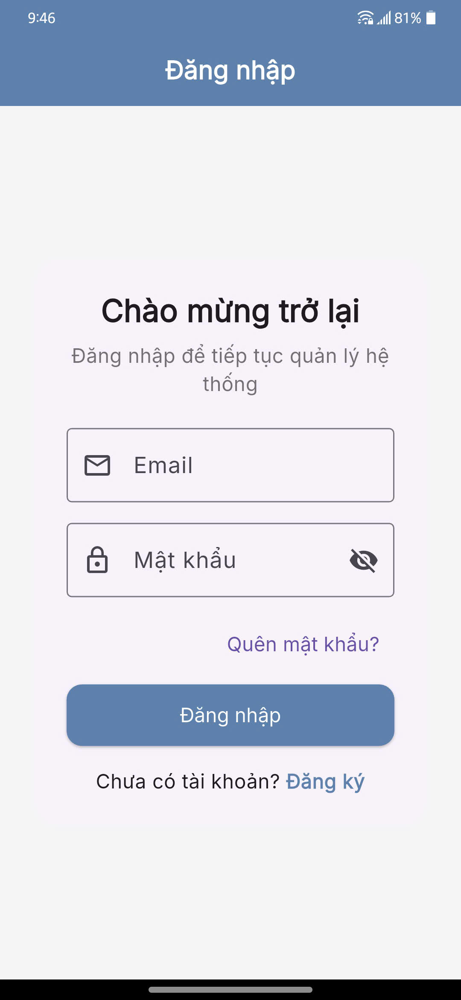 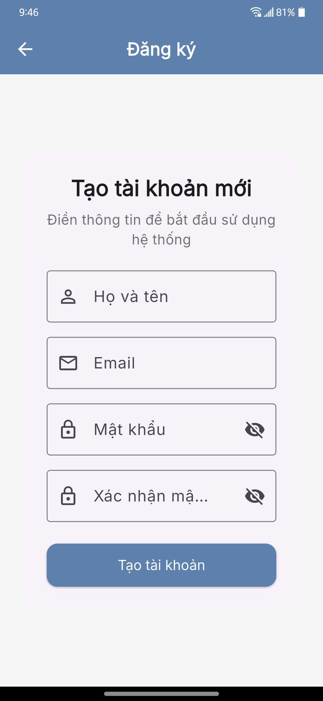 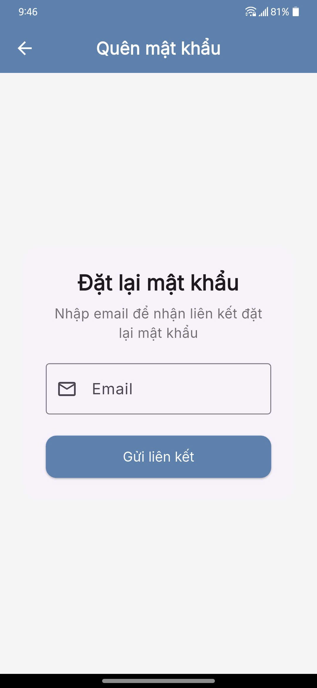 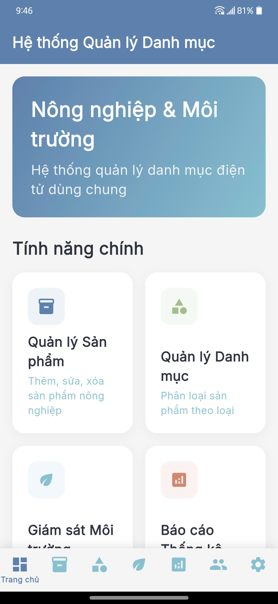 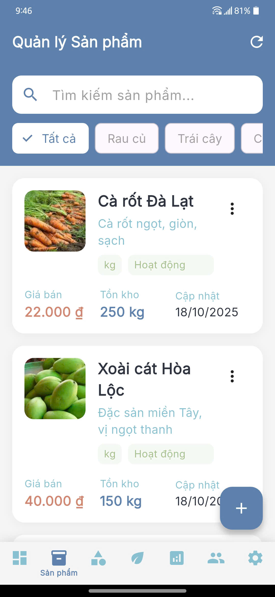 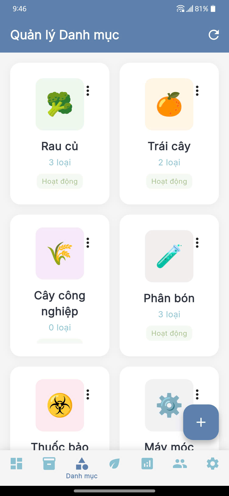 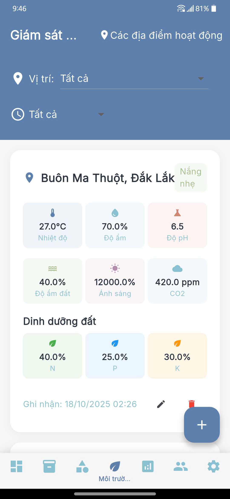 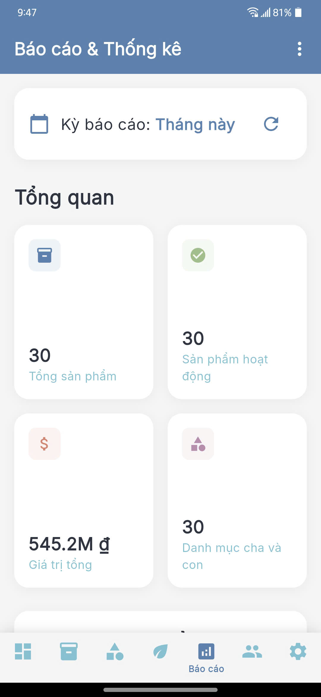 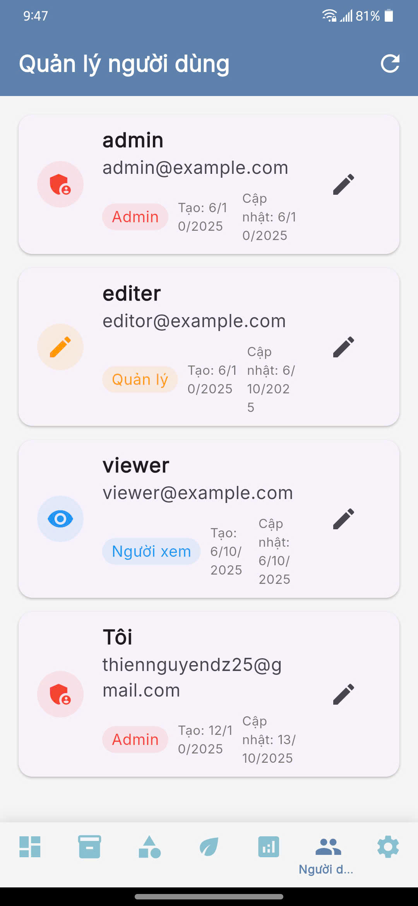 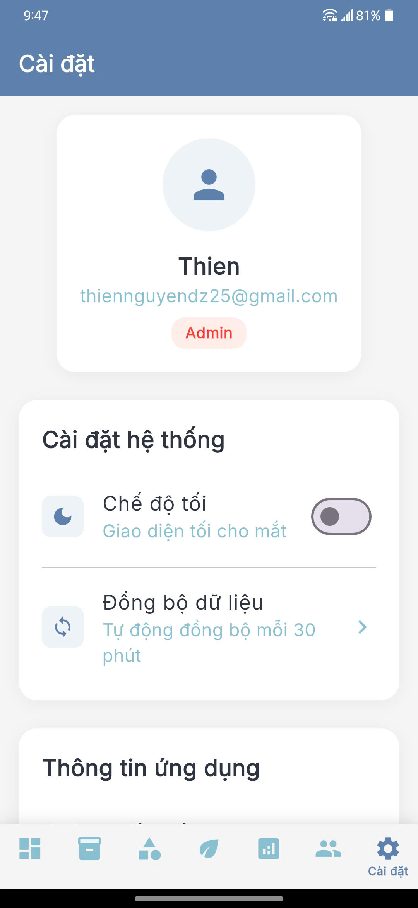 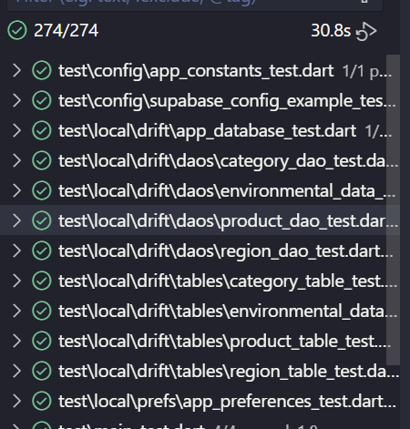